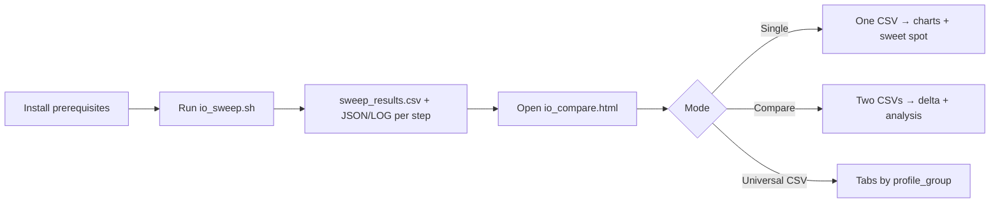

# IO Performance Sweep & Comparison Report

**v4.0 — Universal IO Testing Tool:** a **jobs 1→N** sweep using [fio](https://github.com/axboe/fio), exporting **CSV** with optional **`profile_name`** / **`profile_group`** columns. Open **`io_compare.html`** locally for **single-system** reports, **A/B compare**, or **universal** multi-profile CSVs (tabs follow workload group). No server required.

Repository: [https://github.com/goasutlor/io_perf_test](https://github.com/goasutlor/io_perf_test)

**Release notes:** [RELEASE.md](RELEASE.md) · **Web UI walkthrough:** [docs/IO_COMPARE_WEB.md](docs/IO_COMPARE_WEB.md)

---

## Workflow



1. **Linux (root recommended)** — Run `io_sweep.sh` (Standard mode or a profile mode: Database, VM, Spark, Full Universal, …).  
2. **Output** — CSV under `.../io_sweep_<timestamp>/` (or group-specific prefix) including `profile_name` and `profile_group` for universal runs.  
3. **Web report** — Open `io_compare.html` in a browser. Use **Single System** to analyze one CSV, or **Compare 2 Systems** for two. Universal CSVs are detected automatically; tabs match **`profile_group`**.

---

## Prerequisites

The script checks these automatically at startup (`check_prerequisites`).

| Component | Required? | Role | Example install |
|-----------|-----------|------|-----------------|
| **fio** | Yes | IO benchmark | `yum install fio` / `apt install fio` / `brew install fio` |
| **python3** | Yes | Parse fio JSON → CSV columns | `yum install python3` / `apt install python3` |
| **libaio** | Recommended | `libaio` ioengine (async) | `yum install libaio libaio-devel` / `apt install libaio1 libaio-dev` — if missing, the script falls back to `psync` |
| **sysstat** | Optional | Provides `iostat` (fio already reports util% in JSON) | `yum install sysstat` / `apt install sysstat` |
| **util-linux** | Optional | `sync`, `blockdev` (base system) | Usually pre-installed |
| **tput** | Optional | Terminal width | Usually pre-installed (ncurses) |
| **root** | Recommended | `echo 3 > /proc/sys/vm/drop_caches` between steps | Run with `sudo ./io_sweep.sh` |

**One-line installs (examples):**

- RHEL / Rocky / AlmaLinux:  
  `yum install -y fio python3 libaio libaio-devel sysstat`
- Ubuntu / Debian:  
  `apt install -y fio python3 libaio1 libaio-dev sysstat`
- macOS:  
  `brew install fio python3` (no libaio — sync-style ioengine is used automatically)

---

## Features / Functions (from the shell script)

### Main features

- **Jobs 1→N sweep** — Runs one job count at a time from 1 through `MAX_JOBS` to explore throughput/latency vs. concurrency.  
- **Cache mitigation** — Unique test file per step, **O_DIRECT** (`--direct`), `--invalidate=1`, **drop_caches** when root, short settle delay, delete test files after each step.  
- **Interactive menu** — Path, workload (randwrite / randread / read / write / randrw), block size, max jobs, iodepth, duration, per-job file size, Direct IO on/off.  
- **Rich CSV** — Bandwidth, IOPS, latency (avg, p50–p999, max), CPU, IO util, context switches, profile, engine, timestamp.  
- **End-of-run summary** — Approximate “sweet spot” (Python over CSV) and per-job status (e.g. OK / HIGH LAT / SATURATED).

### Key functions in `io_sweep.sh`

| Function | Purpose |
|----------|---------|
| `check_prerequisites` | Verify fio, python3, libaio, sysstat, tput, and privilege |
| `detect_ioengine` | Choose `libaio` or fallback `psync` |
| `run_menu` | Collect parameters from the user |
| `drop_caches` | `sync` + drop page cache (if root) |
| `parse_json_rich` | Turn fio JSON into one CSV row of numbers |
| `run_one_step` | Run one fio step, progress UI, parse, append CSV |
| `run_sweep` | Create work dir, CSV header, loop jobs 1..N |
| `print_summary` | Print summary and highlight sweet spot |

### Output artifacts

- **`sweep_results.csv`** — Feed directly into `io_compare.html`.  
- **`step_j<N>.json`** — Raw fio JSON per step.  
- **`step_j<N>.log`** — fio stderr per step (debugging).

### CSV header (reference)

```text
jobs,total_qd,bw_mbs,iops,bw_min_mbs,bw_max_mbs,bw_stdev_mbs,lat_avg_ms,lat_p50_ms,lat_p95_ms,lat_p99_ms,lat_p999_ms,lat_max_ms,lat_stdev_ms,slat_avg_us,clat_avg_us,cpu_usr_pct,cpu_sys_pct,io_util_pct,ctx_switches,profile,engine,file_size,timestamp
```

---

## Usage

```bash
chmod +x io_sweep.sh
sudo ./io_sweep.sh    # recommended — enables drop_caches between steps
# ./io_sweep.sh       # non-root — runs, but no cache drop
```

When the run finishes, the script prints the path to `sweep_results.csv` and suggests opening **`io_compare.html`** to upload the file.

### Web report (`io_compare.html` v4)

- Open the file in a browser (double-click or `file:///.../io_compare.html` — no backend).  
- **Single System** — upload one CSV; **Generate Report** shows overview, latency, throughput, resources, IO profile, and analysis (no System B required).  
- **Compare 2 Systems** — optional labels for **System A** / **System B**; upload two CSVs for deltas and verdict text.  
- **Universal CSV** (multiple `profile_name` / non-standard `profile_group`) — the UI builds a **Summary** tab plus **one tab per group** (Spark, Database, VM, …) with charts per profile. See [docs/IO_COMPARE_WEB.md](docs/IO_COMPARE_WEB.md) for implementation details.

---

## Examples from this repository

### Snippet from `io_sweep.sh` (workload menu)

```bash
  echo "   1) randwrite   Random write ← recommended (DB/VM worst case)"
  echo "   2) randread    Random read  (DB query pattern)"
  echo "   3) read        Sequential read  (throughput test)"
  echo "   4) write       Sequential write (throughput test)"
  echo "   5) randrw      Mixed 70R/30W (OLTP simulation)"
```

### Rows from `sweep_results_1.csv`

```csv
jobs,total_qd,bw_mbs,iops,bw_min_mbs,bw_max_mbs,bw_stdev_mbs,lat_avg_ms,lat_p50_ms,lat_p95_ms,lat_p99_ms,lat_p999_ms,lat_max_ms,lat_stdev_ms,slat_avg_us,clat_avg_us,cpu_usr_pct,cpu_sys_pct,io_util_pct,ctx_switches,profile,engine,file_size,timestamp
1,32,348.77,89285,277.82,377.26,22.76,0.3581,0.3338,0.514,0.7496,2.0562,12.6718,0.1424,3.768,354.298,6.47,36.55,99.68,559600,rw=randwrite bs=4k iodepth=32 direct=1 dur=30s,libaio,1g,20260330T093315
2,64,419.06,107279,309.28,457.14,15.11,0.5962,0.5693,0.8806,1.1223,2.5723,9.2667,0.195,5.334,590.832,3.79,27.04,99.77,970731,rw=randwrite bs=4k iodepth=32 direct=1 dur=30s,libaio,1g,20260330T093349
```

### Real-time progress (live terminal “chart”)

While **fio** runs each step, `io_sweep.sh` redraws a **live dashboard** in the terminal (ANSI cursor moves; same lines update about once per second). It is not a GUI chart, but it behaves like a **real-time progress strip**: Braille **spinner** + **filled bar** (`█` vs `░`) + **percent** + **elapsed / runtime** + job parameters and cache hints.

**Behavior (from `run_one_step`):**

| Element | Role |
|---------|------|
| Spinner (`⠋⠙⠹…`) | Shows the step is active |
| Bar + `%` | Elapsed time vs `--runtime` (duration per step) |
| `jobs`, `iodepth`, `total_QD`, `file=` | Current concurrency and unique test file name |
| `Elapsed` / `Remaining` | ETA for this step |
| Final line | Turns green: `✔ [████…] 100% — Done` |

**Illustrative snapshot** (what you see *during* a 30s step — bar length and `%` increase every second until 100%):

```text
══════════════════════════════════════════════════════════════════════════════════
  STEP 4/8  jobs=4    qd_total=128    bs=4k      rw=randwrite
══════════════════════════════════════════════════════════════════════════════════
  [INFO]  Page cache dropped (echo 3 > /proc/sys/vm/drop_caches)

  ⠼ [████████████████████░░░░░░░░░░░░░░░░░░░░░░░░░░░░░░░░░░░░░░]  40%  12s / 30s

  jobs=4     iodepth/job=32    total_QD=128     file=testfile_j4_20260330T094512
  rw=randwrite    bs=4k       direct=1  engine=libaio

  Elapsed: 12s  Remaining: 18s  File size/job: 1g
  Cache: O_DIRECT=1 + drop_caches before step + unique file
```

When the step finishes, that block is replaced by the green 100% line and the numeric summary (Throughput, IOPS, latency percentiles, CPU / util).

A longer capture including configuration, per-step summaries, and the **sweep summary** is in **`Example Result.txt`**. An extra **realtime-only illustration** is in **`shell_realtime_progress_example.txt`**.

### Sweep complete — summary table and sweet spot

After all job counts finish, **`print_summary`** prints **`SWEEP COMPLETE`**, a **per-job table** (IOPS, bandwidth, average latency, P99 latency), and a **Status** column:

| Status | Meaning (heuristic) |
|--------|----------------------|
| **★ SWEET** | Row selected as the sweet spot (see below) |
| **OK** | Latency not yet elevated vs. sweet spot |
| **HIGH LAT** | Average latency > ~2× sweet-spot average |
| **SATURATED** | Average latency > ~2.5× sweet-spot average |

**Sweet spot selection** (embedded Python in `print_summary`): among all rows, find the minimum **average latency**; then, among rows whose average latency is **≤ 2× that minimum**, pick the row with the **highest IOPS**. That row is labeled **★ SWEET** and repeated in the banner line.

**Example end-of-run output** (same run as the sample CSV — condensed from `Example Result.txt`):

```text
══════════════════════════════════════════════════════════════════════════════════
                                                    SWEEP COMPLETE
══════════════════════════════════════════════════════════════════════════════════

  Jobs         IOPS       BW(MB/s)   AvgLat     P99Lat     Status
──────────────────────────────────────────────────────────────────────────────────
  1 jobs       89285      348.77     0.3581ms   0.7496ms   OK
  2 jobs       107279     419.06     0.5962ms   1.1223ms   ★ SWEET
  3 jobs       120336     470.07     0.7973ms   1.5811ms   OK
  4 jobs       124023     484.47     1.0316ms   1.8596ms   OK
  5 jobs       123621     482.9      1.2937ms   2.3429ms   HIGH LAT
  6 jobs       117395     458.58     1.6345ms   2.4084ms   SATURATED
  7 jobs       120184     469.47     1.8629ms   3.4898ms   SATURATED
  8 jobs       124854     487.71     2.0497ms   3.0638ms   SATURATED

══════════════════════════════════════════════════════════════════════════════════
  ★ Sweet spot: 2 jobs  |  IOPS: 107279  |  AvgLat: 0.5962 ms
══════════════════════════════════════════════════════════════════════════════════

  [INFO]  CSV: .../io_sweep_<timestamp>/sweep_results.csv
  [INFO]  Open io_compare.html in browser and upload this CSV to generate charts
```

### Terminal output (full log)

The script prints a banner, confirmation of settings (path, workload, sweep 1→N, iodepth, duration, file size, Direct IO, engine), then each **STEP** with the **live progress dashboard** and per-step Throughput / IOPS / Latency. The full transcript is in **`Example Result.txt`**.

### Web report (HTML)

Comparison UI after uploading two CSV files:


---

## Repository layout

| File | Description |
|------|-------------|
| `io_sweep.sh` | Main sweep script and CSV writer |
| `io_compare.html` | Browser report: single CSV, compare, or universal profile tabs |
| `RELEASE.md` | Version history (v4.0 universal tool) |
| `docs/IO_COMPARE_WEB.md` | Maintainer walkthrough of `io_compare.html` |
| `sweep_results_1.csv`, `sweep_results2.csv` | Sample CSV outputs |
| `Example Result.txt` | Full saved terminal output (config, steps, summary, sweet spot) |
| `shell_realtime_progress_example.txt` | Static “frames” of the live progress bar / spinner |
| `Screenshot *.png` | Sample HTML report screenshots |

---

## Notes

- The script targets **Linux** first (macOS may not offer the same `drop_caches` behavior).  
- Testing production paths should be approved with a rollback plan.  
- Per-job file size should be **larger than RAM** when you need to avoid cache effects in complex cases (the menu includes guidance).

---

## License

Provided as-is for internal IO benchmarking and comparison — follow your organization’s policies before use in production environments.
